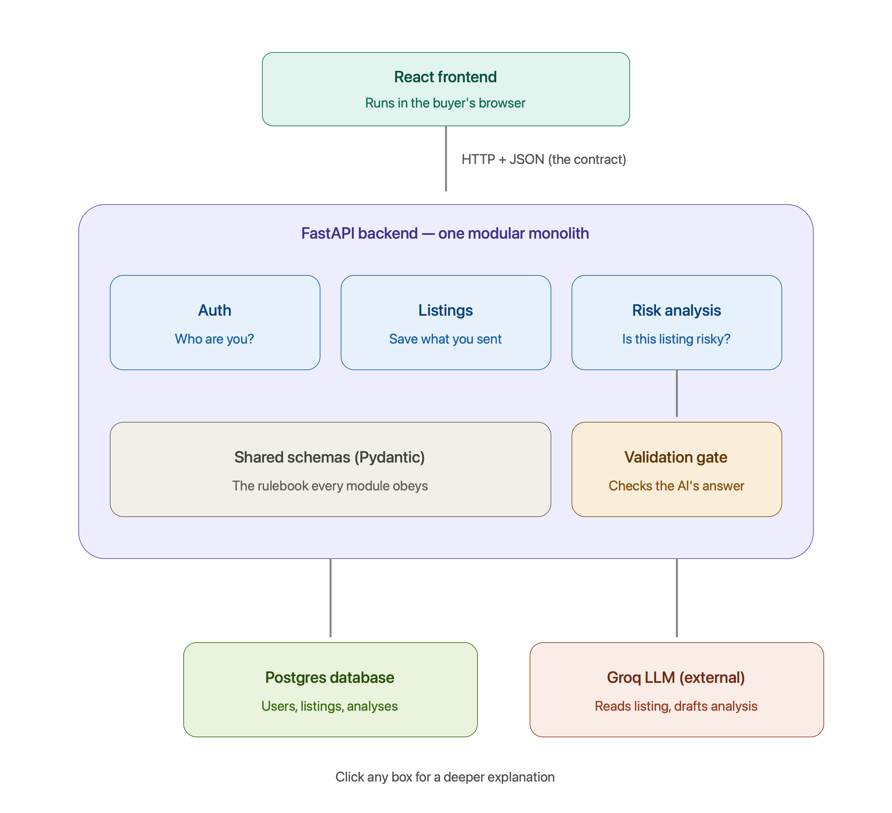
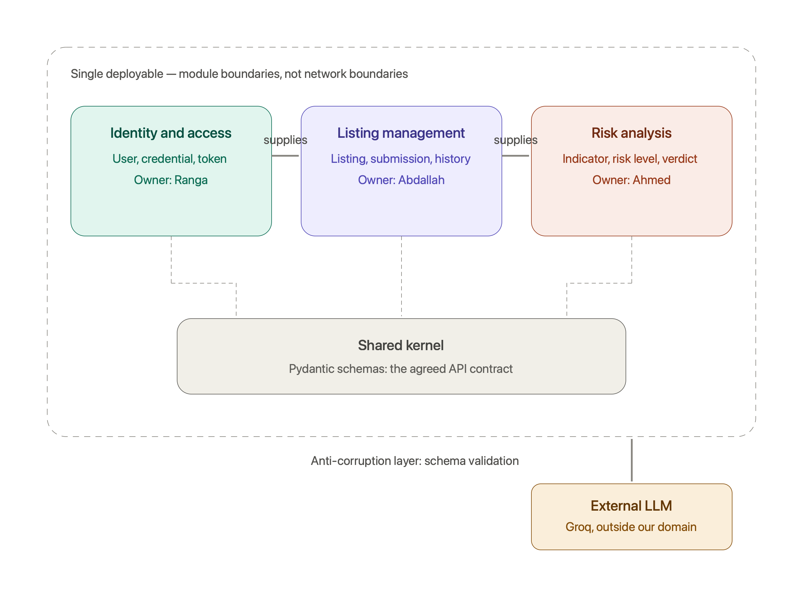

# TrustAI Marketplace — Design & Testing Document

This is the organized, submission-ready design and testing record for the
capstone. It answers *why the system looks the way it does* and *how we
know it works*.

It is a synthesis, not a replacement: `docs/DESIGN_NOTES.md` remains the
raw, chronological decision log — the day-by-day record of what was
decided, when, and in response to what (a Trello card, a bug, a review
comment). That log is itself part of the project's process evidence. This
document reorganizes the same material by topic instead of by date, adds
the architecture and testing detail the log doesn't spell out on its own,
and states plainly where current reality has drifted from an earlier plan.

Every claim below was checked against the actual codebase on `main` while
writing this, not copied from an earlier proposal — see "Known
documentation drift" at the end for the gaps that check turned up.

---

## 1. System overview

TrustAI Marketplace is a decision-support tool for online marketplace
buyers. A buyer submits a listing (title, price, currency, source,
description, optionally a URL or photos); the system runs it through a
categorical risk analysis — a plain-English summary, named risk
indicators, a price plausibility read, a Buy/Caution/Avoid
recommendation, and seller questions to ask before paying — and saves it
to the buyer's private history.

The product's central engineering risk is **AI inconsistency**: an LLM
asked "is this risky?" can return a different answer to the same question
on two separate runs, or invent numbers that sound precise but aren't
calibrated to anything. Most of the architecture decisions below exist to
contain that one risk.

## 2. Architecture

### 2.1 High-level shape

The same system framed as bounded contexts — module ownership, a shared
kernel (Pydantic schemas as the agreed contract), and an anti-corruption
layer (schema validation) in front of the one dependency that doesn't
share the team's assumptions, the external LLM:

**Why a modular monolith, not services.** A 5-person team, 2-month
capstone, and a product surface this size gets nothing from network
boundaries between "auth" and "listings" — only latency, partial-failure
modes, and deployment complexity to manage on top of everything else.
Module boundaries (Python packages: `api/`, `services/`, `models/`,
`schemas/`) give the same ownership separation the bounded-contexts
diagram calls for, without paying for distribution. Component ownership
during initial build: Identity & Access (Ranga), Listing Management
(Abdallah), Risk Analysis (Ahmed) — all three modules share one kernel
(`app/schemas/schemas.py`) as their agreed contract.

### 2.2 Request flow: submitting a listing

1. `POST /api/analyses` — `ListingIn` validates the request body (title,
   price > 0, 3-letter currency, description, optional URL/images) before
   anything else runs.
2. The listing is **committed to Postgres first**, before the AI call.
   This is deliberate (§3.3) — a provider outage must never lose a
   buyer's typed input.
3. `services/ai.py::get_provider()` selects an `AIProvider` implementation
   by the `AI_PROVIDER` env var (`mock` in CI/tests, `groq` — and, as
   further providers land, `gpt`/`gemini` — in real use).
4. The provider returns raw text; `AIAnalysisResult.model_validate_json`
   is the anti-corruption layer — output that doesn't fit the schema is
   rejected, retried once, then surfaced as a `502` with an explicit
   "your listing was saved" message, never a silent guess.
5. `services/scoring.py` computes a deterministic 0-100 display score
   from the validated categorical result (§3.1) and the whole thing is
   persisted as an `Analysis` row with its `RiskIndicator` children.

### 2.3 Data model

Four tables, matching the agreed ERD 1:1: `users` → `listings` →
`analyses` → `risk_indicators` (each a straightforward one-to-many).
Two column choices worth stating the reasoning for:

- `price` is `Float`, not `Numeric` — this tool assesses risk, it doesn't
  move money, so exact decimal precision wasn't worth the friction against
  Pydantic's `float` contract.
- `risk_level` / `recommendation` / `severity` are plain `String`, not a
  native Postgres `ENUM`. They're enforced once already, at the Pydantic
  layer (§3.1) — a DB-level enum would need a migration for every future
  value while adding no real safety on top of that.

**Migrations** are Alembic, evolving the real Postgres schema; tests use
`Base.metadata.create_all` against a throwaway SQLite file instead
(faster, no migration history needed for a database that's rebuilt every
test run). `alembic/env.py` reads `DATABASE_URL` from `core/config.py` at
runtime rather than a DSN baked into `alembic.ini`, so one image works
locally, in CI, and deployed. Migrations run automatically on every
container start (`alembic upgrade head` before `uvicorn` in the
Dockerfile's `CMD`) — this wasn't the original plan (see D-11 in
`DESIGN_NOTES.md` for the incident that made it non-optional: a migration
had shipped in code but the running database had no mechanism to ever
apply it).

### 2.4 The API contract is frozen on purpose (SCHEMA-0)

`backend/app/schemas/schemas.py`, the route signatures/status codes in
`routes.py`, and the `AIProvider` protocol are treated as a frozen
contract (`CLAUDE.md` calls this SCHEMA-0). On a 5-person team building
against each other's modules in parallel, an unannounced field rename or
status-code change breaks someone else's in-flight work silently. Any
contract change is required to be its own PR with its own decision-log
entry — never a side effect of an unrelated story. Additive extensions
(a new endpoint, a new optional field) are fine and happen often; this
just prevents the frozen surface from moving under a teammate's feet.

## 3. Key design decisions

*(Each labeled `D-NN` for traceability back to `docs/DESIGN_NOTES.md`,*
*where the full reasoning and any incident that prompted it is recorded.)*

### 3.1 Categorical risk, never a raw numeric score (D-05)

The single most load-bearing decision in the system. LLM-emitted numeric
"risk scores" aren't calibrated — the same listing analyzed twice can
score 20 points apart with no change in substance, which makes a number
look precise while being meaningless. `AIAnalysisResult` — what every
`AIProvider` must return — therefore has **no numeric field**: risk is
`low | medium | high`, derived from the severities of named indicators,
with a deterministic mapping to a recommendation (high→avoid,
medium→caution, low→buy). This is directly testable
(`test_high_risk_listing_gets_avoid`) in a way a free-floating number
never would be.

**The one numeric value in the app, and why it doesn't reopen this
problem (D-09).** The product still wants a 0-100 score for the UI. Two
early PRs were built against a `risk_score` field that didn't exist yet,
both defensively coded around its possible absence — a shipped regression
waiting to happen. The fix is *not* asking the LLM for a number (that's
exactly what D-05 forbids); `AnalysisOut.risk_score` is computed
**server-side**, after the provider call returns, by a pure function
(`services/scoring.py`) over the already-validated categorical result.
Each `RiskLevel` tier owns a disjoint slice of 0-100 (low 0-33, medium
34-66, high 67-100), so the number can never contradict the categorical
badge it's derived from — which is the actual property D-05 protects, not
"no numbers anywhere in the product."

### 3.2 AI provider abstraction (strategy pattern)

`AIProvider` is a `Protocol` with a `MockProvider` (deterministic
keyword/price heuristics — urgency language, off-platform payment or
contact requests, a per-currency low-price threshold) as the only
implementation CI and tests ever exercise, and one or more real
providers (`GroqProvider`, and as further providers land, an
OpenAI-compatible `GPTProvider` and a `GeminiProvider`) selected at
deploy time by the `AI_PROVIDER` env var. `MockProvider` isn't just a
test fixture — it's executable documentation of the exact fraud signals
the product targets, readable without touching a prompt.

### 3.3 Persist-before-analyze

The listing row is committed to Postgres *before* the AI provider is
called. If the provider is down or times out, the API returns `502` with
an explicit "your listing was saved" message — the buyer never has to
retype anything to retry. This was the error branch missing from the
original sequence diagram and is now load-bearing behavior
(`test_ai_failure_returns_502_and_saves_listing`).

### 3.4 Auth: deliberately minimal

JWT bearer tokens (24h expiry), bcrypt password hashing, every
analysis-related route behind a `get_current_user` dependency. No refresh
tokens, no password reset, no email verification, no server-side token
revocation (logout is client-side discard only) — explicitly out of scope
for a 2-month capstone rather than an oversight. Adding any of these later
needs its own story, not a quiet addition to the auth module.

### 3.5 Configuration is twelve-factor

All deployment-specific values (`DATABASE_URL`, `JWT_SECRET`,
`AI_PROVIDER`, provider API keys) come from environment variables via
`core/config.py`, never hardcoded — the same container image runs
locally, in CI, and deployed. An unrecognized `.env` key no longer crashes
the app at startup (`Settings.Config.extra = "ignore"`) — found the hard
way when a key added to a local `.env` ahead of the PR that declares it
took down the whole app with an opaque `ValidationError` instead of just
being ignored, which is the behavior anyone editing a settings file
actually expects.

### 3.6 In progress / not yet on `main`

Three further decisions are made and coded but live on branches still in
review, not yet merged — listed here so this document doesn't overclaim,
and updated as they land:

- **D-06 — URL fetch preview.** `POST /listings/preview` fetches a
  listing URL server-side (SSRF-guarded: public-IP-only, re-checked after
  redirects, `http(s)`/`text/html` only, size- and timeout-capped) and
  suggests title/description/source. Additive to `ListingIn` — the buyer
  still reviews and submits manually, so nothing scraped ever reaches the
  AI provider or the database unvalidated.
- **D-10 — Multi-LLM provider abstraction.** Extends §3.2 with `gpt` and
  `gemini` alongside `mock`/`groq`, sharing an `OpenAICompatibleProvider`
  base for the two OpenAI-shaped APIs (Groq, OpenAI) since Gemini's
  `contents`/`parts` shape genuinely isn't compatible with that base.
- **D-12 — Listing images (stretch).** Buyers can attach up to 3 photos
  (base64 in Postgres — no new infra, works in SQLite tests, the same
  representation OpenAI/Gemini vision APIs accept natively). Format is
  validated in the schema, size/count caps enforced in the route,
  mirroring how `description`'s length cap already works.
  `AIAnalysisResult` is unchanged either way; `MockProvider` ignores
  images entirely and stays deterministic.

## 4. Design patterns used

For the rubric, explicitly:

| Pattern | Where |
|---|---|
| Layered architecture | `api/` (routes) → `services/` (business logic) → `models/` (persistence) → `schemas/` (contract) |
| Strategy | `AIProvider` — `MockProvider`/`GroqProvider`/etc. selected at runtime by config |
| Dependency injection | FastAPI `Depends` for DB sessions (`get_db`) and the authenticated user (`get_current_user`) |
| Anti-corruption layer | `AIAnalysisResult` validation gate — nothing an LLM says enters the domain unvalidated |
| Repository-lite | SQLAlchemy `Session` objects scoped per-request via `Depends(get_db)` |
| Bounded contexts + shared kernel | Auth / Listings / Risk analysis, sharing Pydantic schemas as the agreed contract (§2.1 diagram) |

## 5. Testing strategy

### 5.1 Test pyramid

- **Unit-level** (`test_security.py`, `test_listing_schema.py`,
  `test_scoring.py`): call `core/security.py`, the `ListingIn` schema, and
  `services/scoring.py` directly — no HTTP, no full DB session beyond a
  throwaway SQLite one where unavoidable. Fast, and a failure points
  straight at the function responsible instead of a whole
  request/response cycle.
- **Acceptance-level** (`test_api.py`): full HTTP round trips through
  FastAPI's `TestClient`, one test per acceptance criterion in
  `docs/BACKLOG.md`. This is the layer the Definition of Done in
  `CLAUDE.md` refers to: every story's tests exist here (historically
  added `@pytest.mark.skip(reason="<story>")` before the story is built,
  then un-skipped once it's real) — "done" means un-skipped and green,
  never weakened to pass.

### 5.2 What's tested and why

- Auth lifecycle and failure modes (register, duplicate email, bad
  credentials) — the security boundary.
- Authorization isolation — a user cannot read another user's analysis
  even by guessing its id (`404`, not `403`, matching the pattern used
  everywhere else) — the most common real-world API vulnerability class
  (IDOR).
- Analysis happy paths for a benign and a scam-signal listing — verifies
  categorical derivation end to end, both directions.
- Input validation (negative price, malformed currency, oversized
  description) — confirms bad input is rejected before any AI spend.
- The AI failure branch — confirms the `502` + saved-listing behavior
  (§3.3) actually holds.
- Deterministic scoring — same `(risk_level, indicators)` always produces
  the same score, and a tier's range never overlaps its neighbor's.

### 5.3 CI and coverage

GitHub Actions runs the full backend suite against `MockProvider` only —
**no network access and no API keys are required or used**, by design
(`CLAUDE.md`'s explicit CI rule) — plus a frontend production build
(`vite build`), on every push and PR. Current numbers on `main`:
**59 tests passing, 99% backend coverage** (`--cov-fail-under=85` is the
enforced floor, kept a few points below the honest total as headroom
rather than a target — see `DESIGN_NOTES.md` for why `app/` needed
`__init__.py` in every package before this number could be trusted at
all: without them, `coverage` silently excluded never-imported files from
the report instead of counting them as 0%).

### 5.4 Not yet covered

- Frontend component tests (no test runner wired up yet for `frontend/`).
- A contract test replaying *recorded* real provider responses through
  the validator (current provider tests use synthetic fakes via
  `monkeypatch`, not captured real traffic).
- Load-testing `/api/analyses`.
- End-to-end tests driving the deployed app (Playwright is used ad hoc
  for manual verification during development — see the git history — but
  isn't wired into CI as a repeatable suite yet).

## 6. Deployment

**Current, actual setup:** on every push to `main`, `.github/workflows/deploy.yml`
builds and pushes both service images to AWS ECR, then deploys to a single
EC2 instance via AWS SSM (`docker compose pull && up -d` against
`deploy/docker-compose.yml`), with nginx in front reverse-proxying `/api`
to the backend container — only port 80 is open on the instance. See
`deploy/README.md` for the full runbook (image names, required GitHub
secrets, one-time instance setup).

This is a **change from the original plan** — see §7 below.

## 7. Known documentation drift

Writing this document meant checking every claim against the actual code
rather than an earlier plan, and that surfaced real gaps between what's
recorded elsewhere and what's true today. Recording them here rather than
silently fixing docs that aren't this document's to rewrite unilaterally:

- **Deployment target moved from the original plan and nothing narrating
  that plan was updated.** `README.md`'s "Planned Architecture" still
  says Caddy + a Hetzner VPS; `ADR-001` (accepted) says Render (static
  site + web service + managed Postgres); all three
  `docs/architecture/*.png` diagrams still show Render/Neon/Supabase in
  their labels. None of that is what's actually running: the real setup
  is AWS EC2 + ECR + nginx, deployed via GitHub Actions + SSM (§6),
  landed some time after those were written and never backfilled. This
  document describes the real thing; `README.md`, `ADR-001`, and the
  diagrams still describe an earlier plan that was superseded. Worth a
  superseding ADR and a diagram refresh — flagged, not fixed here, since
  ADR-001's own "Ownership" section names a specific decision owner.
- **`README.md`'s "Technology Stack" lists TypeScript; the frontend is
  plain JavaScript.** Zero `.ts`/`.tsx` files exist in `frontend/src` —
  all 8 source files are `.jsx`/`.js`, no type annotations anywhere.
- **`README.md`'s "Outside the Initial MVP" list still says image-based
  listing analysis is out of scope.** It's landed as a stretch goal
  (D-12, §3.6) since that line was written.

## 8. Known limitations (stated honestly, not hidden)

- Heuristic/LLM analysis can miss real scams and flag legitimate
  listings — it's decision support, not a guarantee, and the product
  says so in the UI, the API description, and the system prompt.
- No rate limiting yet on `/api/analyses`; a deployed instance exposes
  whichever LLM key is configured to quota abuse. Planned: a simple
  per-user daily cap.
- CORS is wide open (`allow_origins=["*"]`) for development convenience;
  should be restricted to the deployed frontend origin before any wider
  release.
- SQLite (tests) and Postgres (real deployments) can differ subtly on
  JSON column behavior; integration tests running against a real Postgres
  (via Compose) would close that gap.
- No server-side session revocation — logout is client-side token
  discard only (§3.4), a deliberate MVP-scope call, not an oversight.

## 9. Process and governance

- **Branching:** `type/story-id-short-description`, all work via PR to
  `main` — direct commits to `main` aren't used.
- **Commits:** conventional style (`feat:`, `fix:`, `chore:`, `docs:`,
  `test:`, `ci:`), one concern per commit.
- **Decision records:** architecturally significant decisions get either
  a `DESIGN_NOTES.md` entry (numbered `D-NN`, the day-to-day log this
  document draws from) or a full ADR under `docs/decisions/` for
  decisions with real trade-offs and an accountable owner (e.g. `ADR-001`
  deployment platform, `ADR-002` branch protection). A contract change
  under SCHEMA-0 (§2.4) always requires one or the other, never lands as
  a side effect of an unrelated story.
- **Release automation:** semantic-release on `main`, gated by a GitHub
  repository ruleset (not classic branch protection — `ADR-002` explains
  why classic protection couldn't express the bypass the release bot
  needs) requiring 1 PR approval and passing `backend`/`frontend` CI
  checks before merge.
