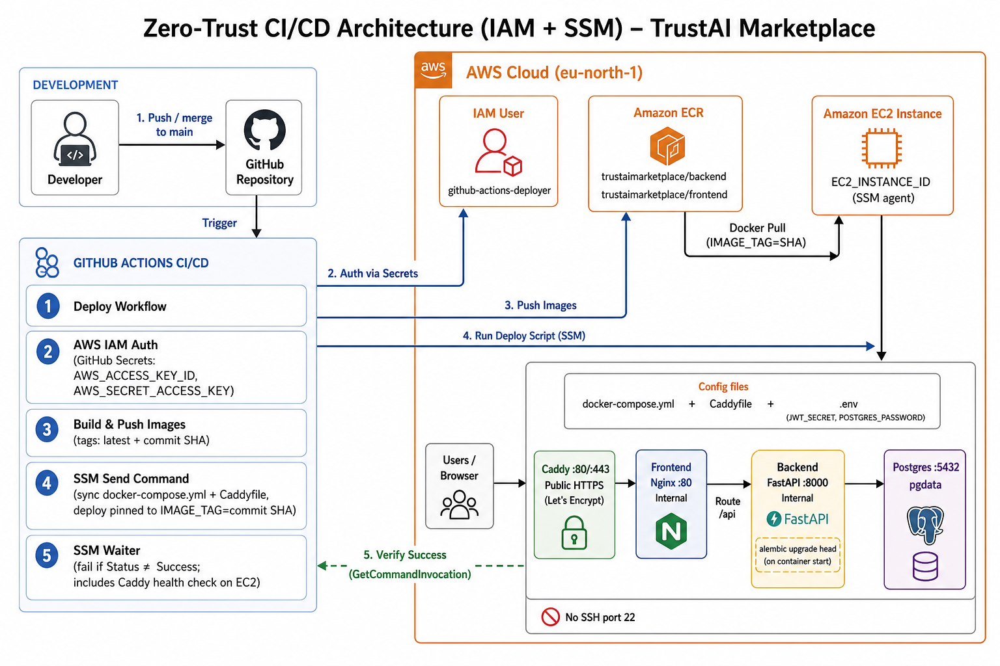

# Zero-Trust CI/CD Pipeline

This document records the TrustAI Marketplace transition from direct SSH-based deployment to a **zero-trust** model using **AWS Systems Manager (SSM)**. GitHub Actions no longer opens SSH connections to the EC2 host; instead, it queues a remote command through the AWS API and waits for a verifiable success status before completing the workflow.

**Related artifacts**

| Artifact | Location |
|----------|----------|
| Deploy workflow | `.github/workflows/deploy.yml` |
| Postgres backup workflow (same SSM pattern, separate schedule) | `.github/workflows/backup.yml` |
| EC2 production stack | `deploy/docker-compose.yml` |
| Operational runbook (ECR, `.env`, first-time setup, backups/restore) | `deploy/README.md` |
| Migration-on-start decision | `docs/DESIGN_NOTES.md` (D-11) |

---

## End-to-end architecture

> **Diagram is stale as of the Caddy/HTTPS change below.** It still shows nginx as the public
> listener on :80. As of that change, **Caddy** is the public listener (ports 80 + 443,
> automatic HTTPS) and reverse-proxies to nginx, which is now internal-only. The diagram needs
> regenerating; the table below is corrected to match the current implementation.



> **Note on auth:** GitHub Actions authenticates with the IAM user **`github-actions-deployer`** using **access keys** stored in GitHub Secrets (`AWS_ACCESS_KEY_ID`, `AWS_SECRET_ACCESS_KEY`). This is **not** OIDC role assumption.

### What the diagram shows

| Element | Implementation |
|---------|----------------|
| Auth | IAM user `github-actions-deployer` via GitHub Secrets (not OIDC) |
| Images | ECR repos `trustaimarketplace/backend` and `trustaimarketplace/frontend` (`:latest` + commit SHA) |
| Deploy | SSM `send-command` to `EC2_INSTANCE_ID` (no SSH) |
| Verification | SSM waiter + `GetCommandInvocation`; job fails unless status is `Success` |
| Public surface | Caddy on **:80/:443** (automatic HTTPS, `deploy/Caddyfile`); nginx and FastAPI are internal-only |
| Config on host | `docker-compose.yml` + `.env` (`JWT_SECRET`, `POSTGRES_PASSWORD`) |
| Schema | `alembic upgrade head` on backend container start (D-11) |

---

## Architecture shift

### Before: SSH from GitHub Actions

The initial deploy workflow used [`appleboy/ssh-action`](https://github.com/appleboy/ssh-action) to connect directly to the EC2 instance:

- Required a long-lived **private SSH key** stored in GitHub Secrets (`EC2_SSH_KEY`).
- Required the instance **host** and **SSH user** (`EC2_HOST`, `EC2_USER`).
- Implied either an **open inbound SSH port** (typically TCP 22) or equivalent direct network reachability from the GitHub Actions runner to the server.

This model couples deployment security to key rotation, port exposure, and trust in a shared credential that grants shell access.

### After: AWS Systems Manager (SSM)

The workflow now deploys through **`aws ssm send-command`**:

- GitHub Actions authenticates to **AWS** (IAM access keys), not to the EC2 host over SSH.
- The command is delivered to the instance by the **SSM agent**, using AWS's control plane.
- No GitHub-stored SSH key and no requirement for GitHub runners to reach the instance on port 22.

```text
  push to main
       │
       ▼
  GitHub Actions (Deploy workflow)
       │
       ├── Build & push images ──► Amazon ECR
       │
       └── aws ssm send-command ──► EC2 (SSM agent)
                │
                └── remote script: ECR login → docker compose pull → up -d
```

**Security outcomes**

- Eliminates direct server access from GitHub via SSH.
- Removes the need to expose SSH to the public internet for CI/CD.
- Centralizes deploy permissions in **IAM policies** (auditable, revocable).
- Deployment success is verified via SSM invocation status, not merely "command queued."

---

## GitHub Secrets management

### Removed (SSH path)

| Secret | Former purpose |
|--------|----------------|
| `EC2_SSH_KEY` | PEM private key for SSH authentication |
| `EC2_HOST` | Public IP or DNS of the EC2 instance |
| `EC2_USER` | SSH login user (`ubuntu`, `ec2-user`, etc.) |

These secrets are **no longer used** by `.github/workflows/deploy.yml`.

### Added / retained (SSM path)

| Secret | Purpose |
|--------|---------|
| `EC2_INSTANCE_ID` | **New.** Target instance for SSM (`i-…`). Replaces host/user/key targeting. |
| `EC2_APP_DIR` | Absolute path on the instance containing `docker-compose.yml` (e.g. `/opt/trustai`). |
| `AWS_ACCESS_KEY_ID` | IAM user credentials for GitHub Actions (`github-actions-deployer`). |
| `AWS_SECRET_ACCESS_KEY` | Paired secret for the IAM user. |
| `AWS_REGION` | AWS region (e.g. `eu-north-1`). |
| `ECR_BACKEND_REPO` | ECR repository name for the API image (`trustaimarketplace/backend`). |
| `ECR_FRONTEND_REPO` | ECR repository name for the UI image (`trustaimarketplace/frontend`). |
| `BACKUP_S3_BUCKET` | **New.** S3 bucket `.github/workflows/backup.yml` uploads Postgres dumps to. Only used by that workflow, not `deploy.yml`. |

Configure under **Repository → Settings → Secrets and variables → Actions**.

---

## AWS IAM configuration

Deploy permissions for GitHub Actions are granted to the IAM user **`github-actions-deployer`** via an **inline policy** attached to that user.

### Required SSM permissions

The policy grants the GitHub Actions principal permission to:

| Action | Purpose |
|--------|---------|
| `ssm:SendCommand` | Queue the remote deploy shell script on the target instance. |
| `ssm:GetCommandInvocation` | Read stdout/stderr and final status after the command runs. |
| `ssm:ListCommandInvocations` | List invocation metadata (supporting status checks and troubleshooting). |

These actions must be scoped to:

- The **target EC2 instance** (`EC2_INSTANCE_ID`), and
- The **SSM documents** used for execution (e.g. `AWS-RunShellScript`).

### Additional permissions (same deployer user)

The same IAM user typically also requires:

- **ECR**: push images from GitHub Actions (`GetAuthorizationToken`, `BatchCheckLayerAvailability`, `PutImage`, etc.).
- **SSM agent permissions (EC2 instance role)**: grant `AmazonSSMManagedInstanceCore` (covers `ssm:UpdateInstanceInformation`, `ssmmessages:*`, `ec2messages:*`) to the instance role — not to the GitHub deployer user.
### EC2 instance requirements

The EC2 host must:

1. Run the **SSM agent** (preinstalled on Amazon Linux / Ubuntu AMIs from AWS).
2. Have an **instance IAM role** allowing ECR pull and any local AWS CLI calls used in the deploy script — including `s3:PutObject` on `BACKUP_S3_BUCKET` for `backup.yml`'s `pg_dump | gzip | aws s3 cp`. That command runs *on* the instance via SSM, so it authenticates as this role, not as `github-actions-deployer` — `backup.yml` needs no new GitHub-side IAM permission, only this instance-role addition.
3. Have **`deploy/docker-compose.yml`** and a local **`.env`** at `EC2_APP_DIR` (secrets are never committed to the repository).

---

## Workflow execution

Workflow file: `.github/workflows/deploy.yml`

**Trigger:** push to `main`, or manual `workflow_dispatch`.

### Phase 1 — Build and publish (GitHub Actions runner)

1. Checkout repository.
2. Configure AWS credentials (`aws-actions/configure-aws-credentials`).
3. Log in to Amazon ECR (`aws-actions/amazon-ecr-login`).
4. Build and push **backend** and **frontend** Docker images.
   - Tags: `latest` and `${GITHUB_SHA}` (immutable traceability per commit).

### Phase 2 — Deploy on EC2 (SSM)

The **Deploy on EC2 via SSM** step:

1. Calls `aws ssm send-command` with document **`AWS-RunShellScript`**.
2. Runs a remote script on the instance:
   ```bash
   set -e
   cd $EC2_APP_DIR
   aws ecr get-login-password … | docker login …
   docker compose pull
   docker compose up -d
   docker image prune -f
   ```
3. Captures the returned **`CommandId`**.

### Phase 3 — Wait and fail closed

Because `send-command` only **queues** work, the workflow implements an explicit waiter:

1. **`aws ssm wait command-executed`** — blocks until the invocation completes or times out.
2. **`aws ssm get-command-invocation`** — emits stdout, stderr, and status to the Actions log.
3. **Job failure** if the waiter exits non-zero or invocation `Status` is not **`Success`**.

This prevents a green GitHub Actions run when `docker compose pull` or container restart fails on the server.

---

## Database migrations

Schema changes are applied automatically at **container startup**, not as a separate manual deploy step.

The backend `Dockerfile` runs:

```dockerfile
CMD ["sh", "-c", "alembic upgrade head && uvicorn app.main:app --host 0.0.0.0 --port 8000"]
```

**Behavior**

- Every backend container start executes `alembic upgrade head` before Uvicorn serves traffic.
- If the database is already at the latest revision, Alembic is a **no-op**.
- Prevents **schema drift** between code (migrations in `backend/alembic/versions/`) and the live Postgres volume on EC2.

**One-time repair (legacy databases)**

If a database was created before Alembic was wired into the Docker image (bootstrapped only via `Base.metadata.create_all()`), it may lack an `alembic_version` table. In that case, stamp the database at the revision matching its actual schema before the first auto-upgrade — see **D-11** in `docs/DESIGN_NOTES.md`.

---

## Verification checklist

After merging deploy changes or rotating secrets:

- [ ] GitHub Actions **Deploy** workflow completes with SSM status **Success**.
- [ ] ECR shows new images tagged with the merge commit SHA.
- [ ] EC2 containers are running: `docker compose ps` under `EC2_APP_DIR`.
- [ ] API health: `GET /api/health` via the public HTTPS domain (Caddy → nginx → backend).
- [ ] Backend logs show Alembic upgrade (or "already at head") before Uvicorn startup.
- [ ] No SSH secrets remain in GitHub Actions for deployment.

---

## Revision history

| Date | Change |
|------|--------|
| 2026-08-12 | Initial documentation of SSH → SSM zero-trust deploy model. |
| 2026-08-17 | Caddy added as the public HTTPS listener (ports 80/443), replacing nginx as the public surface — nginx and FastAPI are now internal-only. Deploy script also switched to commit-SHA-pinned images with config validation and a full health-check gate before success. Text corrected below; diagram still needs regenerating. |
| 2026-08-17 | Added `backup.yml`, a daily scheduled Postgres backup to S3 using the same SSM `send-command` pattern. `pgdata` survives normal redeploys already (no `down -v` in `deploy.yml`), but had no protection against instance replacement or disk failure. |
